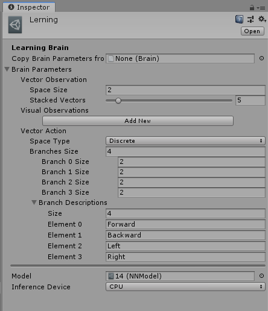
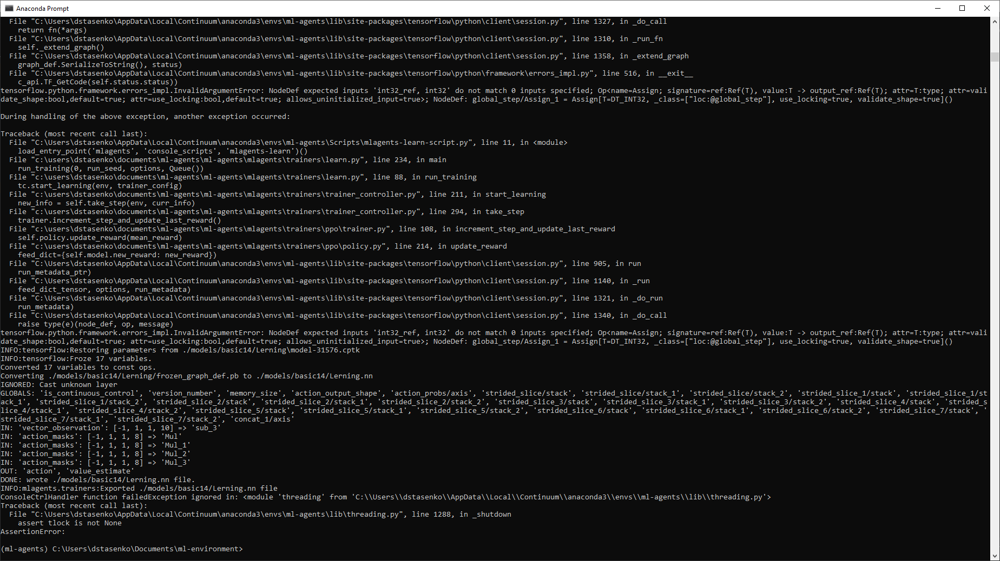

# Java-tensorflow-example
Hi guys!
Here are my first steps using Tensorflow with Java
I used Unity to train simple model:

On the screen we can see Agent (blue cube) and his target - green goal.
Agent and Goal have random spawn on startup and Agent is trying to achieve goal.
When agent collides goal - games begins from start and Agent with goal are re-spawning to new positions.
We can see some logs in console: I logged Agent 'observations' and Agent 'actions' when launched already trained model,
so we can see, that trained model has 2 inputs: X and Y distance to target, and 1 output.
Output is represented as array with size [4] and means [W, A, S, D] keys.
Here, we can see that output is [0, 1, 0, 1] - it means that player (trained model) pressed [S, D] to move 'back' and 'right'
On next screen we can see parameters of trained brain

And here's console after learning in Unity. Here we can see how 'inputs' and 'outputs' are named in graph

and now I'm trying to use this model without Unity environment, 
just 'simulating' same values using Java code and validate it is returning valid result, but got some problems with it

I think, that it can be good template for future projects :)
And Unity environment will be provided soon... (It is refactored standard 'Basic' environment from ml-agents)
